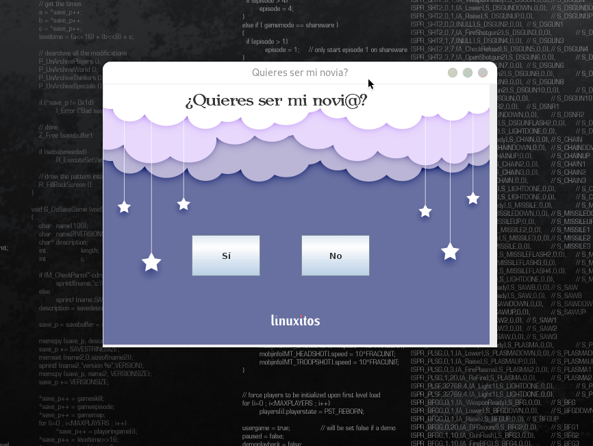

# ¿Quieres ser mi novia?

Un programa en Java simple para decir ¿Quieres ser mi novia?

### Requeremientos

- Fedora 34 (no probado en otro SO aunque puede funcionar en windows)
- JDK > 16
- Netbeans > 16